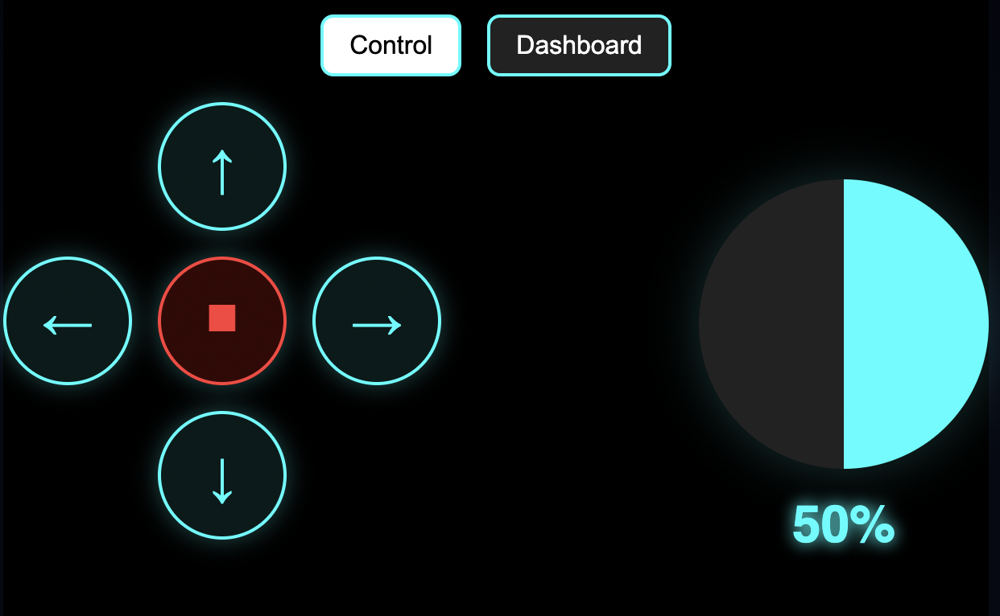
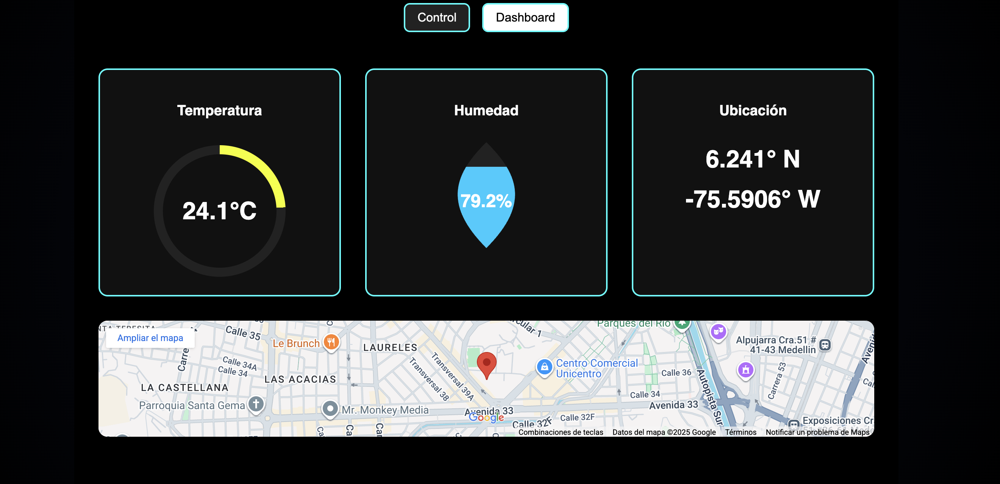

# Aplicativo de IoT

Este repositorio contiene el código fuente para un proyecto de Internet de las Cosas (IoT) que incluye un sistema de sensores, una API y una interfaz de usuario frontend. El proyecto está dividido en cuatro partes principales:

1. **Core/Sensores**: Código para los dispositivos de sensores que recopilan datos del entorno.
2. **Core/Controles**: Código que recibe los comandos de movimiento para un carrito que tiene su receptor y Puente H.
3. **Orion/API**: API desarrollada en NodeJS + Express que captura tanto los comandos de movimiento desde el frontend como los datos enviados por los sensores.
4. **Orion/Frontend**: Interfaz de usuario desarrollada en ReactJS que permite a los usuarios interactuar controlar el carrito con los botones de movimeinto y, además, tiene una vista de Dashboard que permite visualizar los datos enviados por los sensores.

El código dentro de Core debe ser compilado con PlatformIO y está pensado para ser escrito en un LILYGO, mientras que el código dentro de Orion es subido a una máquina virtual de AWS de forma automática con GitHub Actions una vez que se haga push a la rama de **prod**.

Si el job de GitHub Actions corre adecuadamente (hay que agregar los secrets en el repositorio), el usuario puede acceder a la IP pública de la máquina virtual en el puerto 5173 y debería ver algo como esto:

